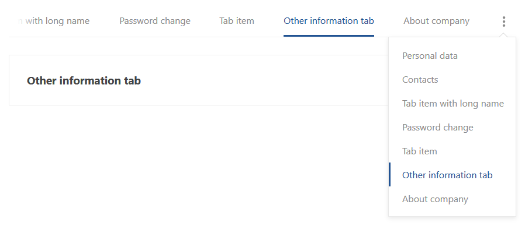

# Adaptive Horizontal Tab Menu

`EN`  

This is a small component which is an adaptive horizontal tab menu. In the case when the menu does not fit the width,
to the right of it there is an auxiliary drop-down menu with a full list of the main menu items, and the position of the main menu is adapted to the screen so that the selected item is always in the visible area.  

You need to install jQuery module: `npm install jquery`  

Documentation:

* [Examples](./docs/en/EXAMPLES.md)
* [Detailed description of the component](./docs/en/DESCRIPTION.md)

`RU`  

Это маленький компонент который представляет из себя адаптивное горизонтальное меню табов. В случае, когда меню не влезает по ширине,
справа от него появляется вспомогательное выпадающее меню с полным списком элементов основного меню, при этом положение основного меню адаптируется под экран так, чтобы выделенный элемент всегда находился в видимой области.  

Необходимо установить jQuery модуль: `npm install jquery`  

Документация:

* [Примеры](./docs/ru/EXAMPLES.md)
* [Подробное описание компонента](./docs/ru/DESCRIPTION.md)
