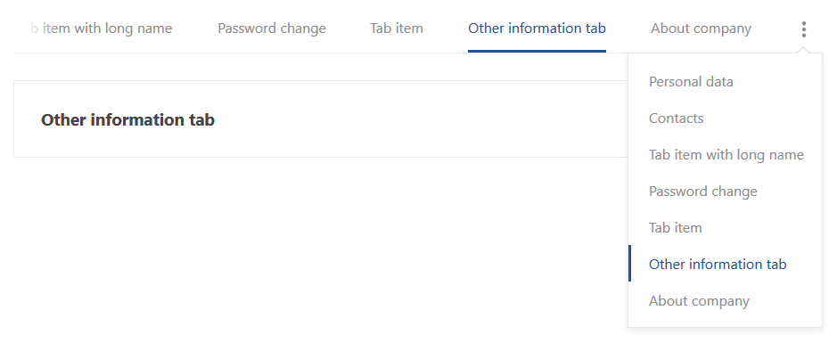

# Adaptive Horizontal Tab Menu

Это маленький компонент который представляет из себя адаптивное горизонтальное меню табов. В случае, когда меню не влезает по ширине,
справа от него появляется вспомогательное выпадающее меню с полным списком элементов основного меню, при этом положение основного меню адаптируется под экран так, чтобы выделенный элемент всегда находился в видимой области.  

Необходимо установить jQuery модуль: `npm install jquery`  

Документация:

* [Примеры](./docs/ru/EXAMPLES.md)
* [Подробное описание компонента](./docs/ru/DESCRIPTION.md)
