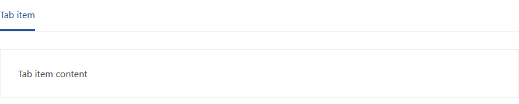

# Adaptive Horizontal Tab Menu

This document contains a detailed description of the component, its structure, behavior, and display.

## HTML

The full HTML structure of the component consists of **Navigation** and **Content**.
However, navigation can be used independently of the content and can be a set of links.



```html
<div class="ah-tab-wrapper">
    <div class="ah-tab">
        <a class="ah-tab-item" href="" data-ah-tab-active="true">Tab item</a>
    </div>
</div>

<div class="ah-tab-content-wrapper">
    <div class="ah-tab-content" data-ah-tab-active="true">
        Tab item content
    </div>
</div>
```

### Navigation / tab wrapper

The simplest navigation component consists of:

* wrapper `div.ah-tab-wrapper`;
* container `div.ah-tab`;
* menu item `a.ah-tab-item`.

`div.ah-tab-wrapper>div.ah-tab>a.ah-tab-item`

```html
<div class="ah-tab-wrapper">
    <div class="ah-tab">
        <a class="ah-tab-item" href="">Tab item</a>
    </div>
</div>
```  

To select the active menu item, use the attribute `data-ah-tab-active="true"`.

```html
<a class="ah-tab-item" href="" data-ah-tab-active="true">Tab item</a>
```  

You can extend the component by adding multiple menu items, and only one of them can contain an activity attribute `data-ah-tab-active="true"`.  

When `JS` initializes a component to **its wrapper** `div.ah-tab-wrapper` renders additional HTML markup, which is responsible for displaying an additional menu if the main menu does not fit on the screen.

Additional HTML markup consists of:  

* own wrapper `div.ah-tab-overflow-wrapper`;
* menu button `button[type="menu"].ah-tab-overflow-menu`;
* container `div.ah-tab-overflow-list`;
* copies of main menu items `a.ah-tab-item`.

```html
<div class="ah-tab-overflow-wrapper">
    <button type="menu" class="ah-tab-overflow-menu"></button>
    <div class="ah-tab-overflow-list">
        <a class="ah-tab-item" href="">Tab item</a>
    </div>
</div>
```  

Copies of the main menu items are **clones** that repeat the behavior of the main items.

> **Important!** The component will not be initialized if before `JS` initialization **wrapper** `div.ah-tab-wrapper`  will contain **additional HTML markup** `div.ah-tab-overflow-wrapper`.

### Content / tab content wrapper

The simplest content component consists of:

* wrapper `div.ah-tab-content-wrapper`;
* content of the menu item `div.ah-tab-content`.

`div.ah-tab-content-wrapper>div.ah-tab-content`

```html
<div class="ah-tab-content-wrapper">
    <div class="ah-tab-content">
        Tab item content
    </div>
</div>
```  

To display the content of the active menu item, use the attribute `data-ah-tab-active="true"`.

```html
<div class="ah-tab-content" data-ah-tab-active="true">
    Tab item content
</div>
```  
