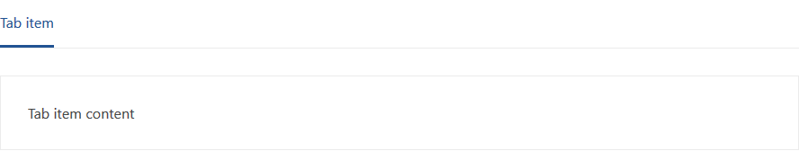

# Adaptive Horizontal Tab Menu

Данный раздел содержит подробное описание компонента, его структуру, поведение и отображение.

## HTML

Полная HTML структура компонента состоит из **Навигации** и **Контента**.
Однако навигация может существовать независимо от контента и выступать в роли обычного набора ссылок.



```html
<div class="ah-tab-wrapper">
    <div class="ah-tab">
        <a class="ah-tab-item" href="" data-ah-tab-active="true">Tab item</a>
    </div>
</div>

<div class="ah-tab-content-wrapper">
    <div class="ah-tab-content" data-ah-tab-active="true">
        Tab item content
    </div>
</div>
```

### Навигация / tab wrapper

Простейший компонент навигации состоит из:

* обертки `div.ah-tab-wrapper`;
* контейнера `div.ah-tab`;
* элемента меню `a.ah-tab-item`.

`div.ah-tab-wrapper>div.ah-tab>a.ah-tab-item`

```html
<div class="ah-tab-wrapper">
    <div class="ah-tab">
        <a class="ah-tab-item" href="">Tab item</a>
    </div>
</div>
```  

Для выделения активного элемента меню используется атрибут: `data-ah-tab-active="true"`.

```html
<a class="ah-tab-item" href="" data-ah-tab-active="true">Tab item</a>
```  

Расширять компонент можно за счет добавления нескольких элементов меню, при этом только один из них может содержать атрибоут активности `data-ah-tab-active="true"`.  

При `JS` инициализации компонента в **его обертку** `div.ah-tab-wrapper` рендерится дополнительная разметка, которая отвечает за отображение дополнительного меню, если основное меню не помещается на экран.  

Дополнительная разметка состоит из:  

* собственной обертки `div.ah-tab-overflow-wrapper`;
* кнопки меню `button[type="menu"].ah-tab-overflow-menu`;
* контейнера `div.ah-tab-overflow-list`;
* копии элементов основного меню `a.ah-tab-item`.

```html
<div class="ah-tab-overflow-wrapper">
    <button type="menu" class="ah-tab-overflow-menu"></button>
    <div class="ah-tab-overflow-list">
        <a class="ah-tab-item" href="">Tab item</a>
    </div>
</div>
```  

Копии элементов основного меню являются **клонами**, которые повторяют поведение основных элементов.  

> **Важно!** Компонент не будет проинициализирован, если до `JS` инициализации **обертка** `div.ah-tab-wrapper` будет содержать в себе **дополнительную разметку** `div.ah-tab-overflow-wrapper`.

### Контент / tab content wrapper

Простейший компонент контента состоит из:

* обертки `div.ah-tab-content-wrapper`;
* контента элемента меню `div.ah-tab-content`.

`div.ah-tab-content-wrapper>div.ah-tab-content`

```html
<div class="ah-tab-content-wrapper">
    <div class="ah-tab-content">
        Tab item content
    </div>
</div>
```  

Для отображения контента активного элемента меню используется атрибут: `data-ah-tab-active="true"`.

```html
<div class="ah-tab-content" data-ah-tab-active="true">
    Tab item content
</div>
```  
